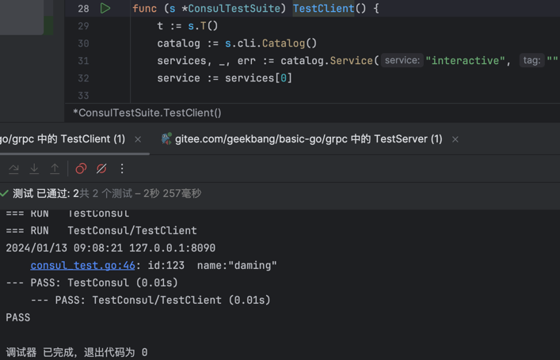

### 使用consul作为注册中心，测试通过

### 为什么使用consul作为注册中心
1.分布式一致性： Consul是一个分布式系统，具有强一致性。它使用Raft协议来确保所有节点之间的一致性，这对于构建可靠的服务发现和配置管理系统非常重要。

2.健康检查和自动恢复： Consul支持健康检查，可以定期检查服务的可用性。如果服务不健康，Consul可以自动将其标记为不可用，同时通知其他服务。这有助于自动发现故障并进行快速恢复。

3.多数据中心支持： Consul设计为支持多数据中心部署，这使得它在全球范围内的大规模分布式系统中表现良好。

4.丰富的API和功能： Consul提供了丰富的HTTP API和功能，可以用于服务注册、健康检查、KV存储、事件处理等。这使得它可以满足各种复杂的需求。

5.社区和生态系统： Consul有一个活跃的社区和丰富的生态系统，这意味着你可以找到很多有用的插件和集成，以及解决问题的文档和支持。
