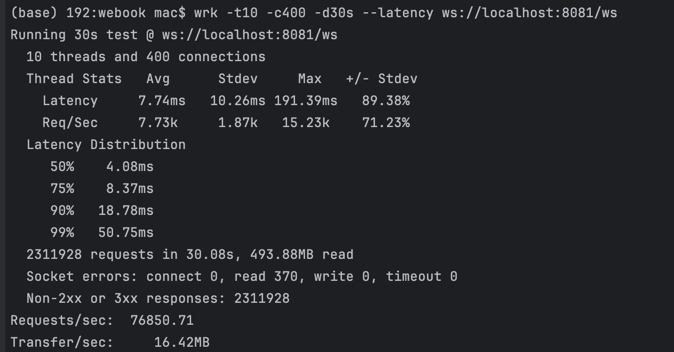
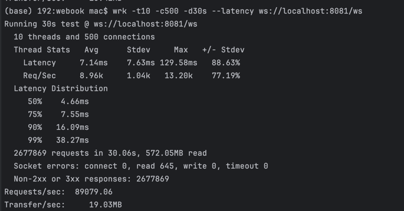
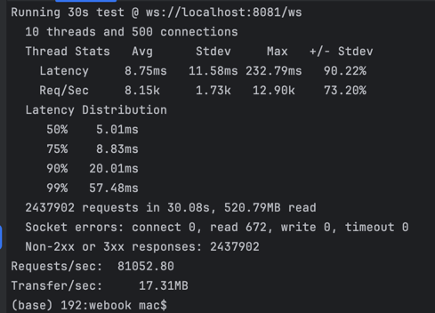
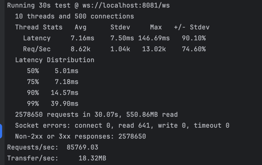
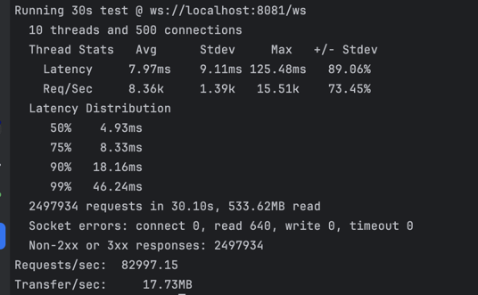
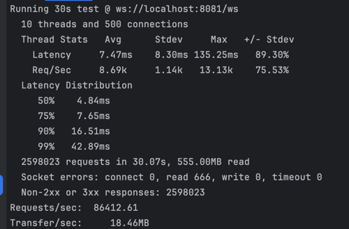

### 默认情况下 10线程 400连接

### 10线程 500连接

### 10线程 500连接 ReadBufferSize 调整为512

### 10线程 500连接 ReadBufferSize,WriteBufferSize 调整为512

### 10线程 500连接 ReadBufferSize,WriteBufferSize 调整为512 响应数据增大

### 10线程 500连接 ReadBufferSize,WriteBufferSize 默认 响应数据增大

综合测试数据可以发现，请求响应数据增大时，请求延迟会相应增大
请求数据不变时增大ReadBufferSize 请求的延迟反而增大了
在实际使用中应该结合请求数据相应调整参数，而不是越大越好。